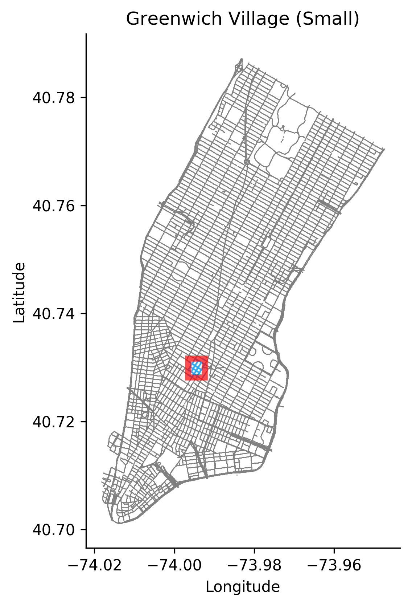

# Simplified Processing Pipeline for DeepMind StreetLearn Dataset

This is a simplified and easier to use data processing pipeline for DeepMind's streetlearn 
dataset. The existing streetlearn codebase hits you with a slice of Google's infra 
structure. With this version, you can dodge that.

**Note**: The usage of the dataset is under a Usage Agreement with google. It seems it is per-
institutution level so FAIR usage are fine, but need to double check with legal. The user
agreement could be found here: [google data set applicaiton form](https://sites.google.com/view/learn-navigate-cities-nips18/dataset)

This is our working repo, so sections below contains mention of the dataset itself that
you might need to sign the form above to access.

<a href="https://github.com/episodeyang/jaynes" target="_blank"></a>

## 2019-06-27 Update

- Reduced the size of `manhattan-small` and `manhattan-medium`.
- Changed the original bounding box to `large` and `xl`. 
- Improved the trajectory by increasing the coverage to 4 (from 1)
- Improve configurability of script by adding temperature and radius config to the `StreetLearnArgs` namespace.
- add summary file to each processed dataset folder. The 

Here are the updated data sets:

```yaml
prefix: ../processed-data/manhattan-tiny 
seed: 1
coverage: 4
size: 53
bbox: (-73.99694545618935, 40.728918740015985, 0.0019080027486779727, 0.0014344303765838617)
```

```yaml
prefix: ../processed-data/manhattan-small 
seed: 1
coverage: 4
size: 255
bbox: (-73.99698090623339, 40.72730617544701, 0.003970809291459432, 0.0034904597927223335)
```

## Simple Usage

### Download only a subset of the data

I have checked in all of the raw data files with `git-lfs`. Everything included is about 2GB, 
so you should configure git locally to only download the datafiles you need. For details see 
this stack overflow bellow:

> https://stackoverflow.com/questions/36376136/is-it-possible-for-git-lfs-pull-to-ignore-some-files-folders

## The data summary 

There are currently 5 reduced datasets:

```yaml
prefix: ../processed-data/manhattan-tiny 
seed: 1
coverage: 4
size: 53
bbox: (-73.99694545618935, 40.728918740015985, 0.0019080027486779727, 0.0014344303765838617)
```

```yaml
prefix: ../processed-data/manhattan-small 
seed: 1
coverage: 4
size: 255
bbox: (-73.99698090623339, 40.72730617544701, 0.003970809291459432, 0.0034904597927223335)
```

```yaml
prefix: ../processed-data/manhattan-medium 
seed: 1
coverage: 4
size: 501
bbox: (-73.99797906458758, 40.72690367880115, 0.006481507781984419, 0.004746123629082888)
```

```yaml
prefix: ../processed-data/manhattan-large 
seed: 1
coverage: 4
size: 1495
bbox: (-73.99699947982805, 40.726008639817245, 0.00999942365351103, 0.007986187313427706)
```

```yaml
prefix: ../processed-data/manhattan-xl 
seed: 1
coverage: 4
size: 5355
bbox: (-73.99699947982805, 40.72600072316067, 0.019993416963771438, 0.015995486385776303)
```

## [Advanced] Processing The Original StreetLearn dataset

**Install LevelDB driver `plyvel`**
LevelDB is dead. You really shouldn't invest time in this, unless you want to get data out of
streetlearn. To install `plyvel`, which was the most popular python library for levelDB on mac
OSX, run the following: 
```
brew install leveldb
CFLAGS='-mmacosx-version-min=10.7 -stdlib=libc++' pip install plyvel --no-cache-dir --global-option=build_ext --global-option="-I/usr/local/Cellar/leveldb/1.20_2/include/" --global-option="-L/usr/local/lib"
```
## Installing ProtoBuff

When you try to run protobuf with
```python
import google.protobuf
```
You will get the following error:
```bash
Traceback (most recent call last):
File "<stdin>", line 1, in <module>
ImportError: No module named google.protobuf
```
In this case you want to install protobuf in your system as sudo:
```bash
pip install --ignore-installed six
sudo pip install protobuf
# ...Installing collected packages: protobuf
# ...Successfully installed protobuf-3.7.1
```


