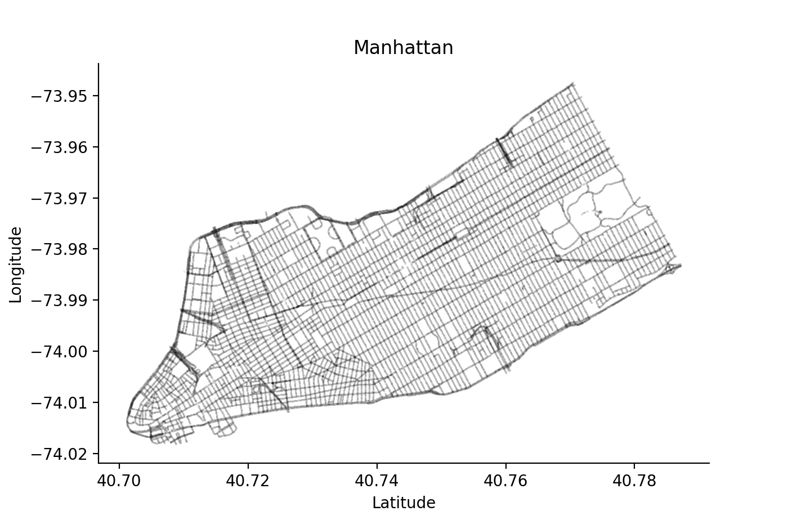

# DeepMind StreetLearn Dataset

This is a simplified and easier to use version of DeepMind's streetlearn dataset. The existing
streetlearn codebase hits you with a slice of Google's infra structure. With this version,
you don't have to.



## Installation

**Install LevelDB driver `plyvel``**
LevelDB is dead. You really shouldn't invest time in this, unless you want to get data out of
streetlearn. To install `plyvel`, which was the most popular python library for levelDB on mac
OSX, run the following: 
```
brew install leveldb
CFLAGS='-mmacosx-version-min=10.7 -stdlib=libc++' pip install plyvel --no-cache-dir --global-option=build_ext --global-option="-I/usr/local/Cellar/leveldb/1.20_2/include/" --global-option="-L/usr/local/lib"
```
## Installing ProtoBuff

When you try to run protobuf with
```python
import google.protobuf
```
You will get the following error:
```bash
    Traceback (most recent call last):
    File "<stdin>", line 1, in <module>
    ImportError: No module named google.protobuf
```
In this case you want to install protobuf in your system as sudo:
```bash
pip install --ignore-installed six
sudo pip install protobuf
# ... Installing collected packages: protobuf
# ... Successfully installed protobuf-3.7.1
```


