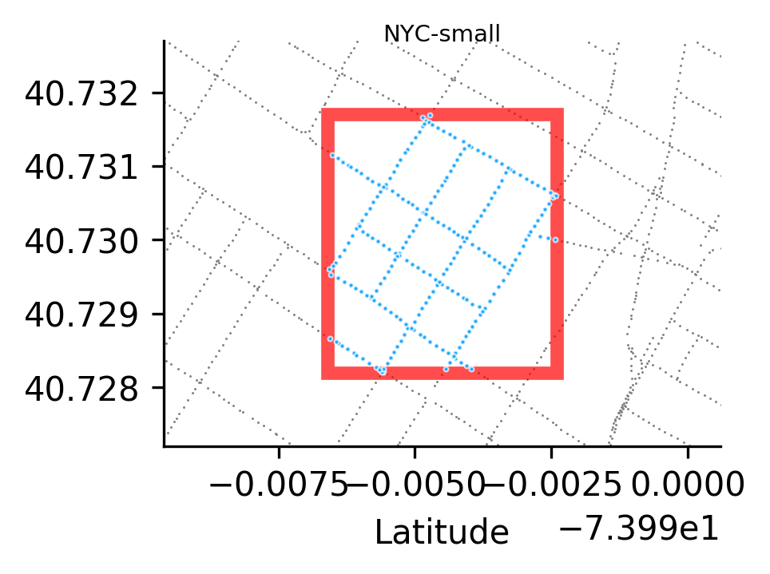
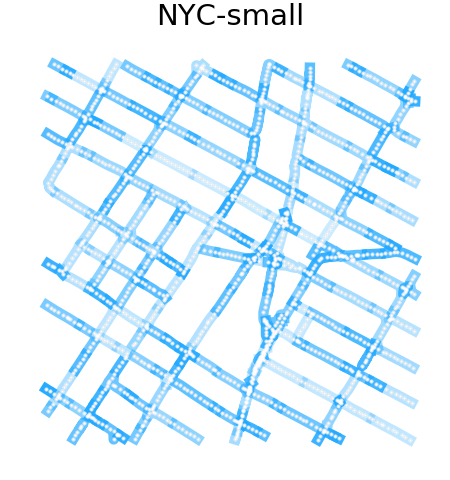

seed: 1
coverage: 4
prefix: ../processed-data/manhattan-small 
size: 254
bbox: (-73.99657862071987, 40.7282067518659, 0.00415966581174132, 0.0034891125851785887)

---

# StreetLearn [small]

The small dataset crops a 3x3 block in lower Manhattan.
We train the local metric using these generated trajectories.

