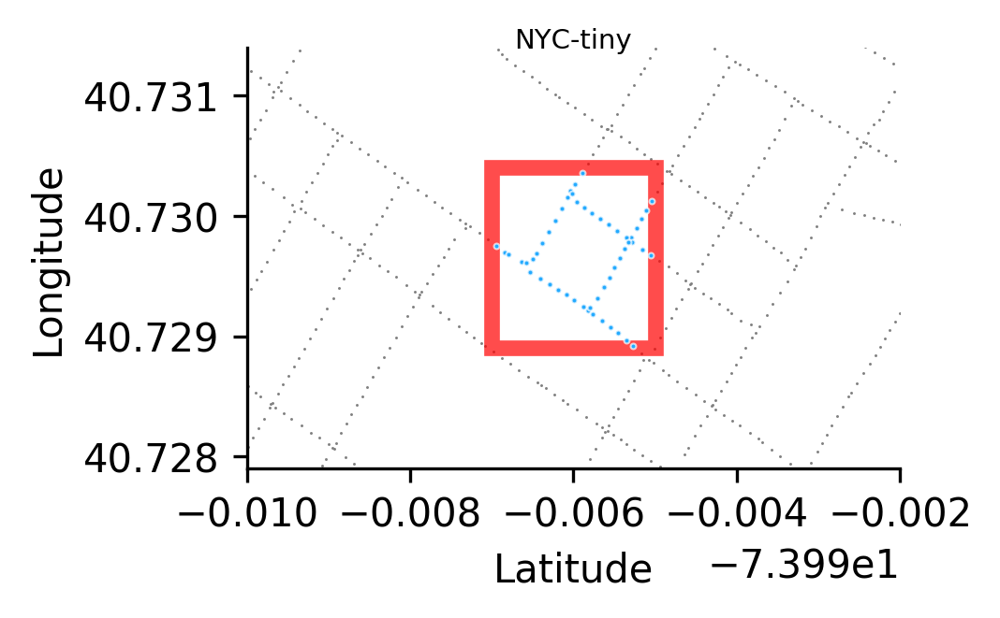
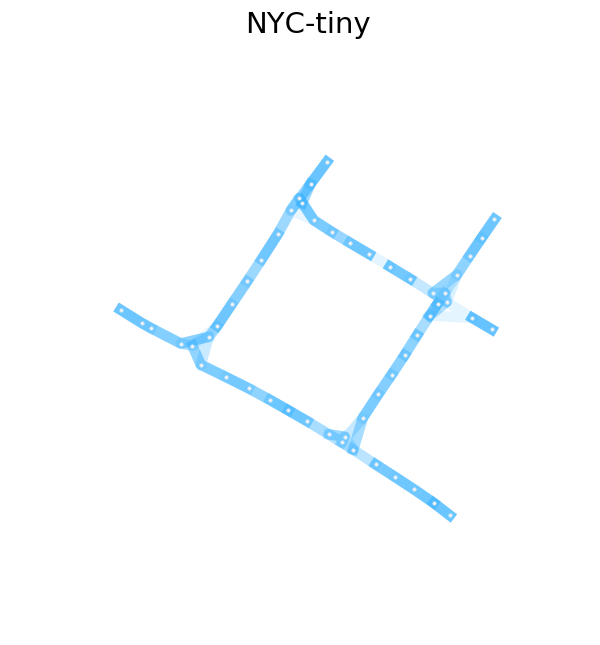
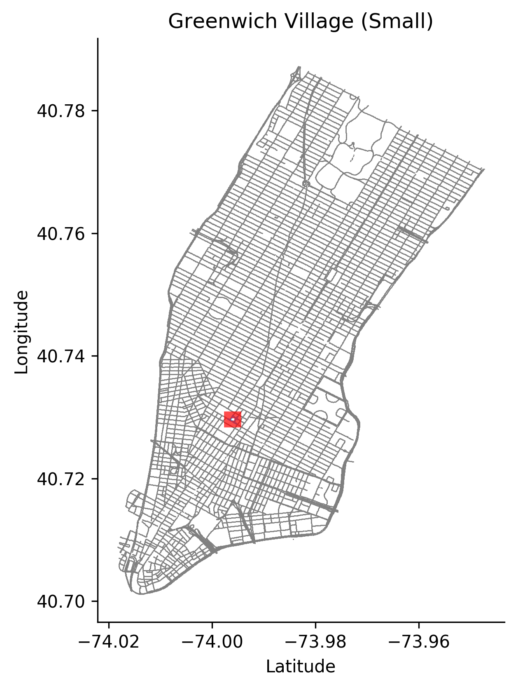

# StreetLearn [tiny]

The tiny dataset crops a 3x3 block in lower Manhattan.
We train the local metric using these generated trajectories.

The placement of the bounding box w.r.t. Manhattan can be seen below:

